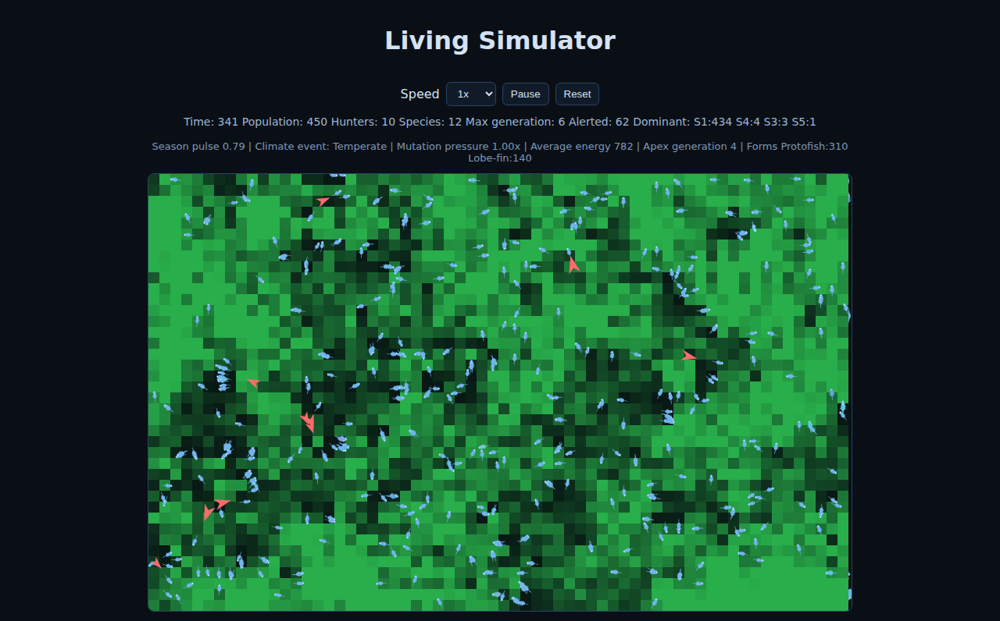
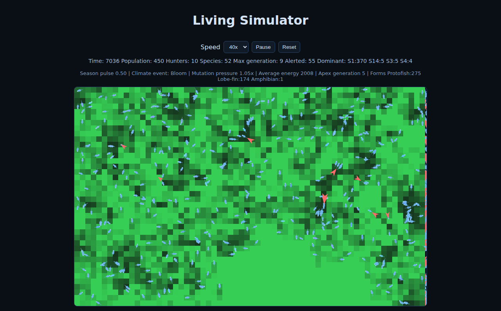
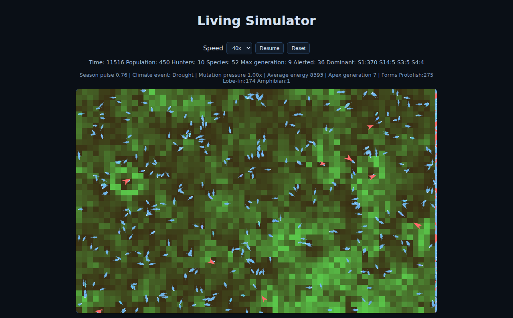

# Living Simulator

An emergent ecosystem sandbox where life adapts, species branch, and apex hunters reshape the food web in real time.

If you like watching complex systems produce surprising outcomes, this simulator gives you fast feedback: hit play, accelerate time, and watch evolution happen on-screen.

## Why it is worth trying

- **Instantly watch evolution:** organisms mutate traits and silhouettes across generations.
- **See real ecological pressure:** climate events and apex hunters force adaptation or collapse.
- **Explore different outcomes every run:** each reset generates a fresh world with new dynamics.
- **Run fast experiments:** speed controls let you jump from first generation to late-stage ecosystems quickly.

## Quick Start

### Run locally

Open `index.html` in a browser, or serve it with any static file server:

```bash
python3 -m http.server 8080
```

Then open `http://localhost:8080`.

### Deploy with GitHub Pages

1. In your repository, go to **Settings** → **Pages**.
2. Under **Source**, choose **Deploy from a branch**.
3. Select your default branch and **/ (root)**, then click **Save**.
4. After deployment, open `https://<your-username>.github.io/<repo-name>/`.

## How to Play

- Watch organisms roam, feed, and compete.
- Monitor climate shifts (bloom, drought, stormfront, aurora) and their ecosystem impact.
- Track hunter pressure as apex predators spawn, chase prey, and reproduce.
- Use **Speed** (`1x` to `80x`) to move from slow observation to rapid simulation.
- Use **Pause** to inspect a stable moment and **Reset** to generate a new world.
- Use **Stats & graphics help** from the main toolbar for a full explanation of stats, breeding, and visual indicators.
- Follow the stat bar to understand the run:
  - **Population**: active organisms
  - **Hunters**: apex predators on the map
  - **Species**: currently distinct species
  - **Max generation**: deepest generation reached
  - **Dominant**: species currently leading by population

## Feature Highlights

- Procedural 2D world with randomized starting conditions
- Trait mutation (speed, size, vision, color) driving evolutionary drift
- Species divergence into distinct lineages
- Body-form progression from protofish toward more complex silhouettes
- Dynamic climate events that alter growth and mutation pressure
- Predator-prey loop with fear behavior and hunter reproduction
- High-speed simulation controls for quick scenario exploration

## Screenshots

### Early simulation overview


### Late-game expansion with population pressure


### Paused dashboard showing deep evolutionary progression

