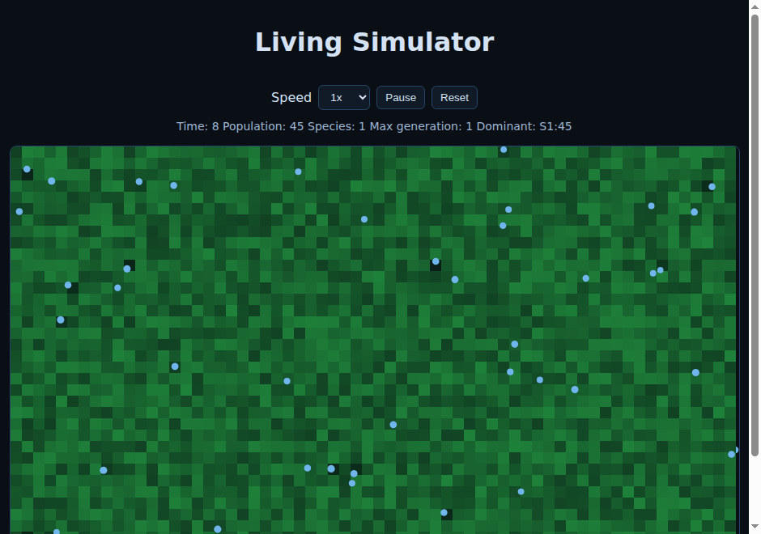

# super-octo-carnival-living-si.

Living Game Simulator.

## Deploy

### GitHub Pages

1. Go to your repository on GitHub.
2. Click **Settings** → **Pages**.
3. Under **Source**, select **Deploy from a branch**.
4. Choose **main** (or your default branch) and **/ (root)**, then click **Save**.
5. After a minute, the simulator will be live at `https://<your-username>.github.io/<repo-name>/`.

### Run Locally

Open `index.html` in a browser, or serve it with any static file server:

```bash
python3 -m http.server 8080
```

Then open `http://localhost:8080` in your browser.

## How to Play

- Watch organisms move around and consume nutrients from the map.
- Use **Speed** to control simulation rate from `1x` to `80x`.
- Click **Pause** to stop/resume the simulation.
- Click **Reset** to restart with a fresh randomized world.
- Track evolution in the stats line:
  - **Population**: current organism count
  - **Species**: number of distinct evolved species
  - **Max generation**: deepest generation reached

## Features

- Random 2D environment map with color variation
- Randomly generated living organisms
- Evolution through mutation of speed, size, vision, and color
- Emergent new species when mutations diverge enough
- Fast-forward speed controls (1x to 80x)

## Screenshots


